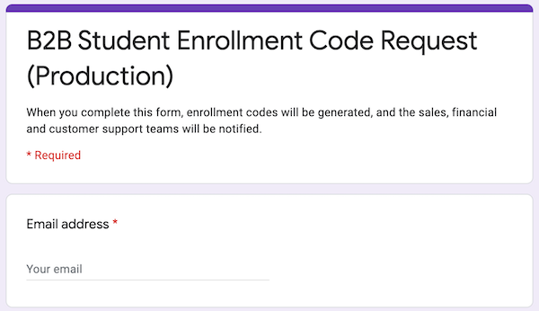

# xPRO Google Sheets

**SECTIONS**
1. [What Is This?](#what-is-this)
1. [How It Works](#how-it-works)
1. [Types of Sheets](#types-of-sheets)
1. [Sheet Basics](#sheet-basics)
1. [Handling Request Sheet Errors](#handling-request-sheet-errors)
1. [Handling Assignment Sheet Errors](#handling-assignment-sheet-errors)
1. [Development Setup](#development-setup)

## What Is This?

Rather than support web UIs for certain internal Customer Support and Finance tasks, we chose to support these tasks  
through UIs that are already very familiar to these teams: Google Sheets and Google Forms. 
Using various Google Drive and Sheets APIs, the following is now possible: 

1. CS/finance users can make various requests (e.g.: enrollment code creation/assignment, enrollment deferrals) by filling 
  out a Google Form or entering data into Google Sheets.
1. Those requests are automatically processed by our app.
1. Users can monitor the status of their requests directly in the spreadsheets.  

## How It Works

The basic workflow for most flavors of xPRO sheets is roughly as follows:

1. A user fills out a Google Form. That form submission is a request for some work to 
be done, and it is automatically added to a form responses worksheet within a relevant spreadsheet.
    - That submission also appears in the main worksheet within the spreadsheet automatically via a query.
1. In response to the change in the spreadsheet, Google sends a file watch request to an endpoint in our app, which 
  indicates to us that the spreadsheet has been changed, so we may have some new/updated requests to handle.
1. Our app scans the main worksheet of the spreadsheet for new/updated rows and takes the appropriate action if the
  data is all valid (e.g.: issuing a refund, creating new enrollment codes, etc.)
1. If a request was completed for some row, or if an error occurred, our app updates certain columns in the 
  main worksheet to indicate the status of that request.

## Types of Sheets

Right now there are three sheet types:

1. Enrollment Code Request sheet (a.k.a. Coupon Request sheet)
1. Enrollment Code Assignment sheets (which are created based on Enrollment Code Request sheet entries)
1. Change of Enrollment Request sheet. This includes worksheets for the following:
    1. Refund Requests
    1. Deferral Requests

New requests for the "request"-type sheets are submitted via Google Form:

1. Enrollment Code Request form
    
1. Refund Request form
    
1. Deferral Request form
    

#### Enrollment Code Request sheet

_Details to be filled in later..._

#### Enrollment Code Assignment sheets

_Details to be filled in later..._

#### Change of Enrollment Request sheet (Refunds, Deferrals)

_Details to be filled in later..._

## Sheet Basics

The terms "main worksheet" and "form responses worksheet" are used below. Here are some
screenshots to explain what those terms are referring to:

**Enrollment Code Request worksheet tabs:**

**Change of Enrollment Request worksheet tabs:**

Some basic details for reading and interacting with these spreadsheets:

1. One cardinal rule to follow for all of the "request"-type sheets: **Do not edit the main worksheet directly, unless the 
  columns exist specifically for direct user input**. Examples of columns that are intended for direct user input are the 
  Finance columns in the Change of Enrollment sheets.
1. If a row in any spreadsheet was successfully processed by our app, there should be a timestamp in a column called 
  "Date Processed"/"Completed Date"/etc., or a success status in the "Status" column.
1. If there is an error in some row (e.g.: a typo), there should be a message in the "Errors" column, or a 
  failure status in the "Status" column. See below for instructions on how to respond to errors in 
  [request sheets](#handling-request-sheet-errors) and in [assignment sheets](#handling-assignment-sheet-errors).

## Handling Request Sheet Errors

As stated above, errors cannot be fixed by directly updating the main worksheet in these spreadsheets. You have
two options for addressing errors: editing the submitted form data, or setting the row to "ignored".

#### Editing Rows

**When you'll want to edit:** there is some bad data in a form submission (a typo, a naming conflict, etc).

**How to do it:** Find the row in the relevant "Form Responses" worksheet that matches the row in the main 
spreadsheet and directly edit the columns there. 

Example scenario: On the Enrollment Code Request spreadsheet, some row has some detail in the Errors column indicating that a
user doesn't exist due to a misspelled email address. To fix this, you would go to the "Form Responses" worksheet 
(which holds the the raw response data from the form), find the row that matches the one you saw on the main worksheet
with the error text, and updated the email column value there. 

Google sends file watch requests to our app if anything in the spreadsheet is edited, so those changes to the Form
Responses data should be handled automatically.

#### Ignoring Rows 

**Request rows cannot be deleted, only set to "ignored".** There are a couple different reasons for this. 
 
**When you'll want to set a row to ignored:** The request is no longer relevant (for example, the request is an accidental repeat). 

**How to do it:** Find the row in the relevant Form Responses worksheet that matches the
row on the main worksheet (check the "Editing Rows" section for details), **and enter `=TRUE` into the "Ignored?" 
column of that row in the Form Responses worksheet.** 

Ignored rows will be greyed out on the main worksheet, and the app will automatically skip over all request rows that 
are set to ignored. 

## Handling Assignment Sheet Errors

Only the "email" column of an assignment sheet can be manually edited, and those cells should only be
edited if the "status" column of that row has (a) no value, indicating that it has not yet been processed,
or (b) an error/failure status, which usually indicates that the email was invalid.

## Development Setup

Instructions can be found here: [xPRO Google Sheets - Developer Setup](./dev-setup.md)
